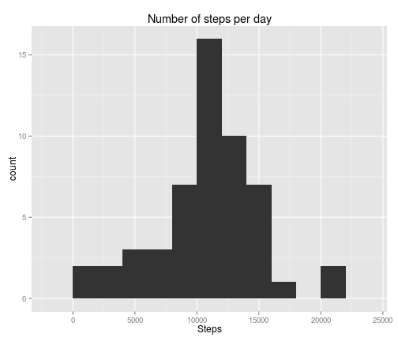

# Reproducible Research: Peer Assessment 1


## Loading and preprocessing the data

```r
data <- read.csv(unz("activity.zip", "activity.csv"), header = TRUE, na.strings = "NA")
data$date <- as.Date(data$date)
```


```r
library(ggplot2)
```

## What is mean total number of steps taken per day?
First it is calculated the overall steps made each day, and then, a new dataframe is created with the information.

```r
Steps <- with(data, sapply(split(x = steps, f = date), sum))
daysteps <- data.frame(Steps, row.names = as.Date(names(Steps)))
```


With this dataframe we can now see the distribution of the total number of steps taken per day.

```r
plot <- ggplot(daysteps)
plot + geom_histogram(aes(Steps), binwidth = 2000) + labs(title = "Number of steps per day")
```

 


We can calculate and store the mean steps made each day and also the median value.

```r
mean <- mean(Steps, na.rm = TRUE)
mean
```

```
## [1] 10766
```

```r
median <- median(Steps, na.rm = TRUE)
median
```

```
## [1] 10765
```

The mean of the distribution is **1.0766 &times; 10<sup>4</sup>** and the median **10765**.

## What is the average daily activity pattern?
We create a new dataframe with the mean number of steps in each interval of 5 minutes during the day and plot the time series.


```r
Interval <- with(data, sapply(split(x = steps, f = interval), mean, na.rm = TRUE))
IntervalSteps <- data.frame(as.integer(as.character(names(Interval))), Interval)
names(IntervalSteps) <- c("Interval", "MeanSteps")

plot <- ggplot(IntervalSteps)
plot + geom_line(aes(Interval, MeanSteps))
```

 


```r
max <- max(IntervalSteps$MeanSteps, na.rm = TRUE)
max
```

```
## [1] 206.2
```

```r
maxInterval <- IntervalSteps$Interval[IntervalSteps$MeanSteps %in% max]
maxInterval
```

```
## [1] 835
```

The interval with the maximum value is the **835**, and the mean number of steps made in those 5 minutes was **206.1698**

## Imputing missing values
We want to know if there are rows with missing values.

```r
na <- sum(is.na(data))
```

We find out that there are 2304 rows with missing values. To fill these gaps we can replace the missing value with the rounded mean value of the corresponding interval. We define a function that does the job.

```r
datafull <- data
fill <- function(steps, interval) {
    if (is.na(steps)) {
        steps <- round(IntervalSteps$MeanSteps[IntervalSteps$Interval %in% interval])
    }
    steps
}

datafull$steps <- mapply(fill, data$steps, data$interval)
```


The histogram of the data has changed:

```r
Steps <- with(datafull, sapply(split(x = steps, f = date), sum))
daysteps <- data.frame(Steps, row.names = as.Date(names(Steps)))
plot <- ggplot(daysteps)
plot + geom_histogram(aes(Steps), binwidth = 2000) + labs(title = "Number of steps per day")
```

 

The shape of the distribution has changed, now there are more days with similar total steps.


```r
meanfull <- mean(Steps, na.rm = TRUE)
meanfull
```

```
## [1] 10766
```

```r
medianfull <- median(Steps, na.rm = TRUE)
medianfull
```

```
## [1] 10762
```

The mean of the distribution now is is **1.0766 &times; 10<sup>4</sup>** (vs. the old 1.0766 &times; 10<sup>4</sup>) and the median **1.0762 &times; 10<sup>4</sup>** (vs. the old 10765). So, the mean is still the same, but the median has decreased 3 steps.

## Are there differences in activity patterns between weekdays and weekends?

We use weekdays() function to classify the measures into weekdays or weekend

```r
datafull$weekday <- weekdays(datafull$date)
datafull$weekday[datafull$weekday %in% c("Saturday", "Sunday")] <- "Weekend"
datafull$weekday[datafull$weekday %in% c("Monday", "Tuesday", "Wednesday", "Thursday", 
    "Friday")] <- "Weekday"
datafull$weekday <- as.factor(datafull$weekday)
```


We create again a new dataframe with the mean number of steps in each interval of 5 minutes during the day and plot the time series.

```r
rm(mean)  # To avoid R misunderstanding mean as a variable
plot <- ggplot(datafull, aes(interval, steps))
plot + stat_summary(fun.y = mean, geom = "line") + facet_grid(weekday ~ .)
```

 


We can see that in weekdays there are more steps in early hours and in weekends in late intervals.
